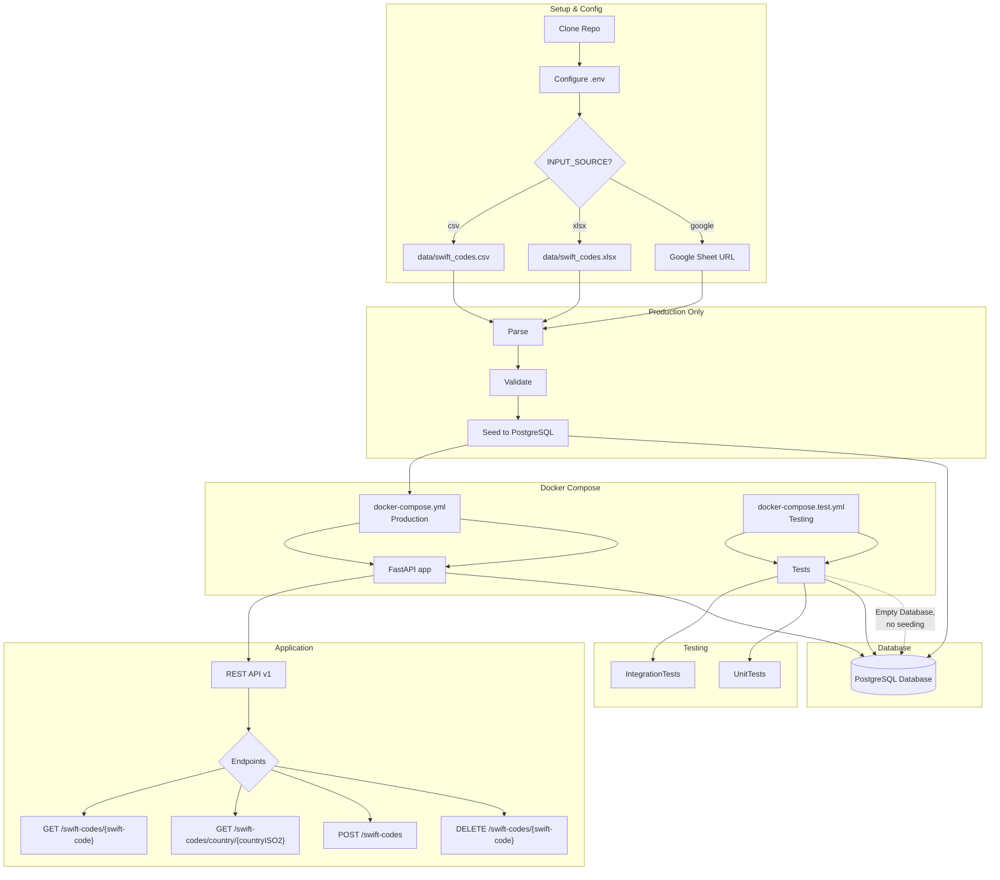

# SWIFT Codes API

## Table of Contents
- [Overview](#overview)
- [Tech Stack](#tech-stack)
- [Project Structure](#project-structure)
- [Project Architecture](#project-architecture)
- [Features](#features)
- [Setup & Installation](#setup--installation)
- [Endpoints](#endpoints)
- [Example .env Configuration](#example-env-configuration)
- [Potential Improvements](#potential-improvements)
- [What I Learned](#what-i-learned)

---

## 📖 Overview <a id="overview"></a>
This project parses, validates, stores, and serves SWIFT codes data over a RESTful API. It supports quick lookups for individual SWIFT codes or country-based queries, and the API provides functionality to add or delete SWIFT code entries. It supports data ingestion from multiple sources _(.csv, .xlsx, google sheets)_ and includes unit & intergration testing strategies.

**Note:**
While the project itself is simple, I intentionally chose to use asynchronous stack and tools I hadn't used before _(ex. Alembic, pytest-asyncio)_ to challenge myself, learn by doing and complete my internship assignment all at once. This project was a valuable learning experience, and I appreciate the opportunity.

---

## ⚙️ Tech Stack <a id="tech-stack"></a>
- **FastAPI**: Asynchronous REST API.
- **Uvicorn**: ASGI server for running FastAPI.
- **Async SQLAlchemy**: Asynchronous ORM for interacting with PostgreSQL.
- **PostgreSQL (asyncpg)**: Asynchronous driver for PostgreSQL.
- **Pandas & OpenPyXL**: Data parsing and manipulation.
- **Alembic**: Database migrations management.
- **Pytest, pytest-asyncio, HTTPX & ASGI Lifespan**: Asynchronous testing.
- **Docker & Docker Compose**: Containerization.
---

## 📂 Project Structure <a id="project-structure"></a>
```
📁 swift-api-remitly
├── 📄 .env
├── 📄 .env.example
├── 📄 .gitignore
├── 📄 alembic.ini
├── 📄 docker-compose.test.yml
├── 📄 docker-compose.yml
├── 📄 Dockerfile
├── 📄 entrypoint.sh
├── 📄 poetry.lock
├── 📄 pyproject.toml
├── 📄 README.md
├── 📁 alembic
│   ├── 📄 env.py
│   └── 📁 versions
│       ├── 📄 65aed48f204f_add_index_to_country_iso2.py
│       └── 📄 bef8e9a4593e_create_swift_codes_table.py
├── 📁 app
│   ├── 📄 main.py
│   ├── 📁 api
│   │   └── 📁 v1
│   │       └── 📄 swift_codes.py
│   ├── 📁 core
│   │   ├── 📄 config.py
│   │   └── 📄 database.py
│   ├── 📁 ingestion
│   │   ├── 📄 parse_data.py
│   │   ├── 📄 seed_data.py
│   │   └── 📄 validate_data.py
│   ├── 📁 models
│   │   └── 📄 swift_code.py
│   └── 📁 schemas
│       └── 📄 swift_code.py
├── 📁 data
│   ├── 📄 swift_codes.csv
│   └── 📄 swift_codes.xlsx
├── 📁 scripts
│   └── 📄 wait-for-it.sh
└── 📁 tests
    ├── 📄 conftest.py
    ├── 📁 integration
    │   └── 📄 test_swift_codes.py
    └── 📁 unit
        ├── 📄 test_parse_data.py
        └── 📄 test_validate_data.py
```

## 📊 Project Architecture & Workflow <a id="project-architecture"></a>




---

## 🔥 Features <a id="features"></a>
- Data ingestion from multiple sources (`xlsx`, `csv`, or `google`). Set your preference in the `.env` file.
- Google Sheets parsing using a clever trick, where you convert URL to a downloadable CSV (and then parse CSV normally).
- RESTful API for CRUD operations on SWIFT codes.
- Asynchronous tech stack throughout the project for potential scalability.
- Project is using containerization for easy deployment via Docker.

---

## Setup & Installation <a id="setup--installation"></a>

Clone the repository:
```bash
git clone <repository-url>
cd swift-api-remitly
```

Rename `.env.example` to `.env` and customize settings as needed:
```bash
cp .env.example .env
```

To run the main API and database:
```bash
docker compose up --build
```

To run unit & integration tests:
```bash
docker compose -f docker-compose.test.yml up --build
```

Both docker-compose setups use ephemeral tmpfs for convenience of testing.

---

## 🌐 Endpoints <a id="endpoints"></a>
- **Retrieve a single SWIFT code**:
  ```http
  GET /v1/swift-codes/{swift-code}
  ```
- **Retrieve SWIFT codes for a country**:
  ```http
  GET /v1/swift-codes/country/{countryISO2}
  ```
- **Add new SWIFT code**:
  ```http
  POST /v1/swift-codes
  ```
- **Delete SWIFT code**:
  ```http
  DELETE /v1/swift-codes/{swift-code}
  ```

Refer to the code for detailed response structures.

---

## 🔧 Example .env Configuration <a id="example-env-configuration"></a>
This exact layout was provided to you in .env.example for your convenience, simply rename it to .env.
```
# Main Database
POSTGRES_USER=remitly
POSTGRES_PASSWORD=password
POSTGRES_DB=swiftcodes
DATABASE_URL=postgresql+asyncpg://remitly:password@db:5432/swiftcodes

# Test Database
TEST_POSTGRES_DB=swiftcodes_test
TEST_DATABASE_URL=postgresql+asyncpg://remitly:password@db:5432/swiftcodes_test

# Input & Parse
# INPUT_SOURCE Options: (xlsx / csv / google)
INPUT_SOURCE=google
XLSX_FILE_PATH=data/swift_codes.xlsx
CSV_FILE_PATH=data/swift_codes.csv
GOOGLE_SHEET_URL=https://docs.google.com/spreadsheets/d/1iFFqsu_xruvVKzXAadAAlDBpIuU51v-pfIEU5HeGa8w/edit?gid=0#gid=0

# Developer Mode 
DEV_MODE=false
```

---

## 🚧 Potential Improvements <a id="potential-improvements"></a>
_With Thanksgiving coming up, my time was limited, but I made some notes along the way about potential improvements:_
- Add a hashmap/sql table for ISO2-Country Name mapping. Currently it grabs the ISO2 from one of rows in the table, which is unreliable _(what if the row data is incorrect?)_.
- Refactor endpoints with separate validation services for cleaner, more maintainable code.
- Extensive logging implementation for enhanced monitoring.
- Optimize Pydantic schemas using inheritance to reduce redundancy and align with DRY principles. Right now it's repeating a lot of same fields between schemas, though you could argue that being more explicit is good.
- Add code formatting tools (for example Black) for consistency.
- Improve async integration tests by finding a better alternative to the NullPool solution _(honsetly, no clue after 10h+ of debugging)_.
- Decouple data seeding from app startup to prevent errors when data was already seeded _(this is not a problem with tmpfs, but would be in production setting)_.

---

## 📚 What I Learned <a id="what-i-learned"></a>
Even though this project is relatively simple, I have intentionally used asynchronous stack and a few things that I have previously never used, to learn through practice.
I have found that learning by doing, creating projects with technologies you didn't yet use is the best way to get acquianted with them.

- This was my first experience with Alembic, and connecting it through env.py was quite a struggle in the beginning. But I understand it's used a lot in production and can definitely see why it would be useful in a team setting.
- Pydantic config was also new to me, until now I would use .env file with a config.py that specifically imports variables using os.getenv(). For larger project Pydantic settings approach seems to make more sense to me.
- Discovered Docker healthchecks a little too late... 🙈 I used a wait-for-it.sh community script, thinking that there is no better way to check if Postgres is accepting connections. Only near the end of the project, I have learned that healthchecks are a thing, and because it's almost Thanksgiving and a long weekend, I decided to keep both in the project.
- My first contact with pytest-asyncio and async tests. I learned a lot about testing during this project, and it was by far the part I spent the most time on. I was stuck for easily 10+ hours, because of a "Future attached to a different loop" error. The problem is surprisingly poorly documented online, and even the FastAPI documentation seems to mention that it can happen, but doesn't provide exact mitigation steps. I ended up using a workaround with poolclass=NullPool to disable pooling entirely, which does resolve the original problem and the cost is negligible, but in a larger application the cost of opening/closing a new connection on each test could be problematic.

---
